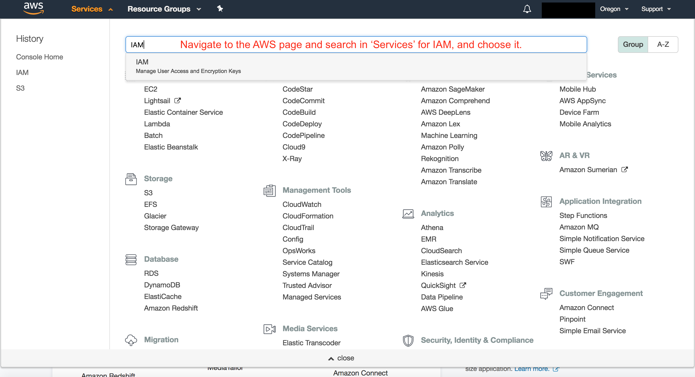
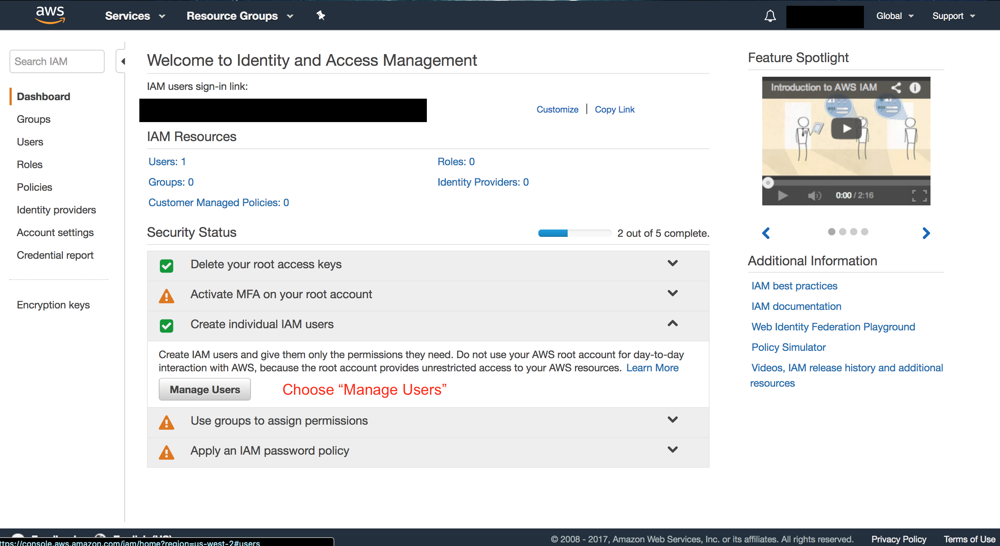
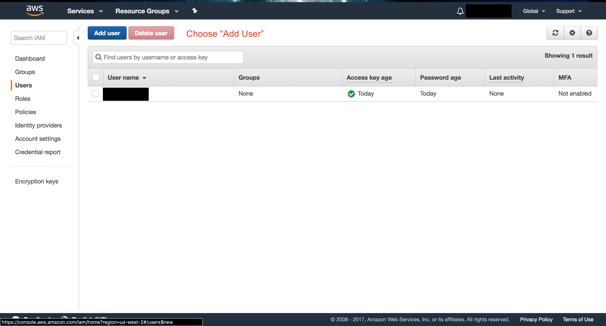
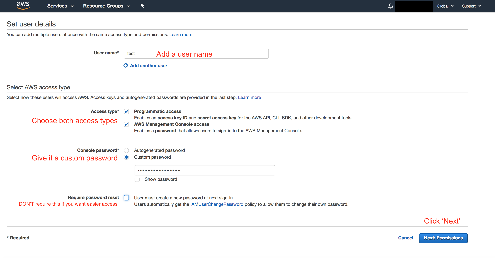
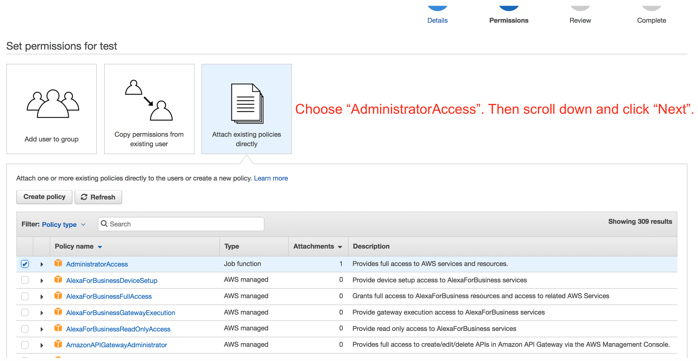
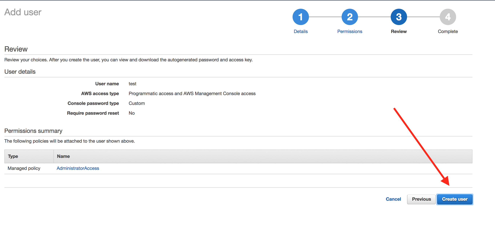
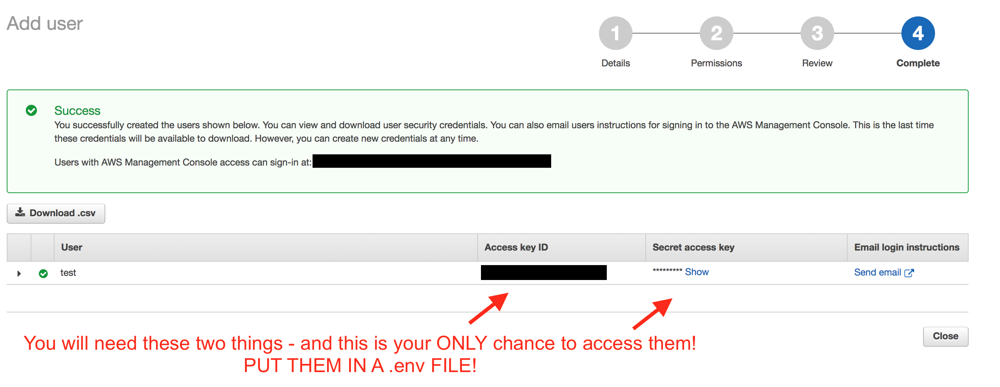

# S3 Demo

## Dependencies

- axios
- express
- aws-sdk
- body-parser
- dot-env

## Setting up AWS

To start you will need to make an account with amazon AWS (Amazon Web Services). AWS offers a large variety of tools that range from database, to processing power. The feature we will be using is called S3 (Simple Storage Solution) and it is a bucket (their name not mine) where we can upload any file we want, and get back a URL to access that file. Another feature AWS has is IAM (Identity and Access Management) that can generate keys to give users the ability to access features on the AWS account, like S3.

## Setting up IAM

We need to make an account inside of IAM and it will give us the access keys we need. Follow the Images below to get the credentials you need.

## Setting up S3

Once you have made an Admin account in the IAM console we need to make a bucket in S3. Click on the services nav bar item and under Storage select S3. Once there click on the "Create Bucket" button and follow the images below. Be aware that the name of the bucket you make must be unique from every other bucket made by any user in the world.

